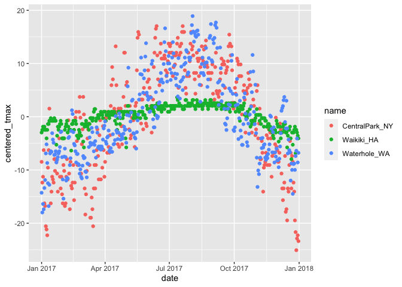

EDA
================

``` r
library(tidyverse) ##use ggplot 2
```

    ## ── Attaching packages ─────────────────────────────────────── tidyverse 1.3.2 ──
    ## ✔ ggplot2 3.3.6      ✔ purrr   0.3.4 
    ## ✔ tibble  3.1.8      ✔ dplyr   1.0.10
    ## ✔ tidyr   1.2.0      ✔ stringr 1.4.1 
    ## ✔ readr   2.1.2      ✔ forcats 0.5.2 
    ## ── Conflicts ────────────────────────────────────────── tidyverse_conflicts() ──
    ## ✖ dplyr::filter() masks stats::filter()
    ## ✖ dplyr::lag()    masks stats::lag()

``` r
library(patchwork)
```

using dplyr verbs (group_by and summarize), along with numeric data
summaries.

## Load NOAA weather dataset

Same dataset with Visualization part 1 and part 2, the only exception is
the addition of month variable, created using lubridate::floor_date().

``` r
weather_df =  
  rnoaa::meteo_pull_monitors(
    c("USW00094728", "USC00519397", "USS0023B17S"),
    var = c("PRCP", "TMIN", "TMAX"), 
    date_min = "2017-01-01",
    date_max = "2017-12-31") %>%
  mutate(
    name = recode(
      id, 
      USW00094728 = "CentralPark_NY", 
      USC00519397 = "Waikiki_HA",
      USS0023B17S = "Waterhole_WA"),
    tmin = tmin / 10,
    tmax = tmax / 10,
    month = lubridate::floor_date(date, unit = "month")) %>%
  select(name, id, everything())
```

    ## Registered S3 method overwritten by 'hoardr':
    ##   method           from
    ##   print.cache_info httr

    ## using cached file: ~/Library/Caches/R/noaa_ghcnd/USW00094728.dly

    ## date created (size, mb): 2022-10-04 23:26:41 (8.408)

    ## file min/max dates: 1869-01-01 / 2022-10-31

    ## using cached file: ~/Library/Caches/R/noaa_ghcnd/USC00519397.dly

    ## date created (size, mb): 2022-10-04 23:26:46 (1.699)

    ## file min/max dates: 1965-01-01 / 2020-03-31

    ## using cached file: ~/Library/Caches/R/noaa_ghcnd/USS0023B17S.dly

    ## date created (size, mb): 2022-10-04 23:26:49 (0.951)

    ## file min/max dates: 1999-09-01 / 2022-10-31

## group_by

Datasets are often comprised of groups defined by one or more
(categorical) variable; group_by() makes these groupings explicit so
that they can be included in subsequent operations.

it is sometimes necessary to remove groups using ungroup().

use summarize to create one-number summaries within each group, or use
mutate to define variables within groups.

``` r
weather_df %>%
  group_by(name, month)
```

    ## # A tibble: 1,095 × 7
    ## # Groups:   name, month [36]
    ##    name           id          date        prcp  tmax  tmin month     
    ##    <chr>          <chr>       <date>     <dbl> <dbl> <dbl> <date>    
    ##  1 CentralPark_NY USW00094728 2017-01-01     0   8.9   4.4 2017-01-01
    ##  2 CentralPark_NY USW00094728 2017-01-02    53   5     2.8 2017-01-01
    ##  3 CentralPark_NY USW00094728 2017-01-03   147   6.1   3.9 2017-01-01
    ##  4 CentralPark_NY USW00094728 2017-01-04     0  11.1   1.1 2017-01-01
    ##  5 CentralPark_NY USW00094728 2017-01-05     0   1.1  -2.7 2017-01-01
    ##  6 CentralPark_NY USW00094728 2017-01-06    13   0.6  -3.8 2017-01-01
    ##  7 CentralPark_NY USW00094728 2017-01-07    81  -3.2  -6.6 2017-01-01
    ##  8 CentralPark_NY USW00094728 2017-01-08     0  -3.8  -8.8 2017-01-01
    ##  9 CentralPark_NY USW00094728 2017-01-09     0  -4.9  -9.9 2017-01-01
    ## 10 CentralPark_NY USW00094728 2017-01-10     0   7.8  -6   2017-01-01
    ## # … with 1,085 more rows

## Counting things

### Summarize

``` r
weather_df %>%
  group_by(month) %>%
  summarize(n_obs = n())
```

    ## # A tibble: 12 × 2
    ##    month      n_obs
    ##    <date>     <int>
    ##  1 2017-01-01    93
    ##  2 2017-02-01    84
    ##  3 2017-03-01    93
    ##  4 2017-04-01    90
    ##  5 2017-05-01    93
    ##  6 2017-06-01    90
    ##  7 2017-07-01    93
    ##  8 2017-08-01    93
    ##  9 2017-09-01    90
    ## 10 2017-10-01    93
    ## 11 2017-11-01    90
    ## 12 2017-12-01    93

``` r
weather_df %>%
  group_by(name, month) %>%
  summarize(n_obs = n())
```

    ## `summarise()` has grouped output by 'name'. You can override using the
    ## `.groups` argument.

    ## # A tibble: 36 × 3
    ## # Groups:   name [3]
    ##    name           month      n_obs
    ##    <chr>          <date>     <int>
    ##  1 CentralPark_NY 2017-01-01    31
    ##  2 CentralPark_NY 2017-02-01    28
    ##  3 CentralPark_NY 2017-03-01    31
    ##  4 CentralPark_NY 2017-04-01    30
    ##  5 CentralPark_NY 2017-05-01    31
    ##  6 CentralPark_NY 2017-06-01    30
    ##  7 CentralPark_NY 2017-07-01    31
    ##  8 CentralPark_NY 2017-08-01    31
    ##  9 CentralPark_NY 2017-09-01    30
    ## 10 CentralPark_NY 2017-10-01    31
    ## # … with 26 more rows

use summarize() to compute multiple summaries within each group. As an
example, we count the number of observations in each month and the
number of distinct values of date in each month.

``` r
weather_df %>%
  group_by(month) %>%
  summarize(
    n_obs = n(),
    n_days = n_distinct(date))
```

    ## # A tibble: 12 × 3
    ##    month      n_obs n_days
    ##    <date>     <int>  <int>
    ##  1 2017-01-01    93     31
    ##  2 2017-02-01    84     28
    ##  3 2017-03-01    93     31
    ##  4 2017-04-01    90     30
    ##  5 2017-05-01    93     31
    ##  6 2017-06-01    90     30
    ##  7 2017-07-01    93     31
    ##  8 2017-08-01    93     31
    ##  9 2017-09-01    90     30
    ## 10 2017-10-01    93     31
    ## 11 2017-11-01    90     30
    ## 12 2017-12-01    93     31

### count()

To count things, you could use count() in place of group_by() and
summarize() if you remember that this function exists. I’ll also make
use of the name argument in count, which defaults to “n”.

``` r
weather_df %>%
  count(month, name = "n_obs")
```

    ## # A tibble: 12 × 2
    ##    month      n_obs
    ##    <date>     <int>
    ##  1 2017-01-01    93
    ##  2 2017-02-01    84
    ##  3 2017-03-01    93
    ##  4 2017-04-01    90
    ##  5 2017-05-01    93
    ##  6 2017-06-01    90
    ##  7 2017-07-01    93
    ##  8 2017-08-01    93
    ##  9 2017-09-01    90
    ## 10 2017-10-01    93
    ## 11 2017-11-01    90
    ## 12 2017-12-01    93

count() is a useful tidyverse alternative to Base R’s table function.
Both functions produce summaries of how often values appear, but table’s
output is of class table and is hard to do any additional work with,
while count produces a dataframe you can use or manipulate directly. For
an example, run the code below and try to do something useful with the
result…

``` r
weather_df %>%
  pull(month) %>% 
  table
```

    ## .
    ## 2017-01-01 2017-02-01 2017-03-01 2017-04-01 2017-05-01 2017-06-01 2017-07-01 
    ##         93         84         93         90         93         90         93 
    ## 2017-08-01 2017-09-01 2017-10-01 2017-11-01 2017-12-01 
    ##         93         90         93         90         93

## (2x2 tables)

### group_by + summarize

for categorical variables: look at the number of cold and not-cold days
in Central Park and Waterhole.

``` r
weather_df %>% 
  mutate(
    cold = case_when(
      tmax <  5 ~ "cold",
      tmax >= 5 ~ "not_cold",
      TRUE      ~ ""
  )) %>% 
  filter(name != "Waikiki_HA") %>% 
  group_by(name, cold) %>% 
  summarize(count = n())
```

    ## `summarise()` has grouped output by 'name'. You can override using the
    ## `.groups` argument.

    ## # A tibble: 4 × 3
    ## # Groups:   name [2]
    ##   name           cold     count
    ##   <chr>          <chr>    <int>
    ## 1 CentralPark_NY cold        44
    ## 2 CentralPark_NY not_cold   321
    ## 3 Waterhole_WA   cold       172
    ## 4 Waterhole_WA   not_cold   193

### pivot_wider/janitor::tabyl

2x2 table using pivot_wider, or you could use janitor::tabyl

``` r
weather_df %>% 
  mutate(cold = case_when(
    tmax <  5 ~ "cold",
    tmax >= 5 ~ "not_cold",
    TRUE     ~ ""
  )) %>% 
  filter(name != "Waikiki_HA") %>% 
  janitor::tabyl(name, cold)
```

    ##            name cold not_cold
    ##  CentralPark_NY   44      321
    ##    Waterhole_WA  172      193

## General summarize

### mean(), median(), var(), sd(), mad(), IQR(), min(), and max()

``` r
weather_df %>%
  group_by(month) %>%
  summarize(
    mean_tmax = mean(tmax),
    mean_prec = mean(prcp, na.rm = TRUE),
    median_tmax = median(tmax),
    sd_tmax = sd(tmax))
```

    ## # A tibble: 12 × 5
    ##    month      mean_tmax mean_prec median_tmax sd_tmax
    ##    <date>         <dbl>     <dbl>       <dbl>   <dbl>
    ##  1 2017-01-01      10.8     37.0          6.1   13.1 
    ##  2 2017-02-01      12.2     57.9          8.3   12.1 
    ##  3 2017-03-01      13.0     54.6          8.3   12.4 
    ##  4 2017-04-01      17.3     32.9         18.3   11.2 
    ##  5 2017-05-01      NA       28.4         NA     NA   
    ##  6 2017-06-01      23.5     18.7         27.2    8.73
    ##  7 2017-07-01      NA       12.7         NA     NA   
    ##  8 2017-08-01      26.3     10.2         27.2    5.87
    ##  9 2017-09-01      23.8      9.94        26.1    8.42
    ## 10 2017-10-01      20.1     41.5         22.2    9.75
    ## 11 2017-11-01      14.0     61.5         12.0   11.6 
    ## 12 2017-12-01      11.0     40.2          8.9   11.9

``` r
weather_df %>%
  group_by(name, month) %>%
  summarize(
    mean_tmax = mean(tmax),
    median_tmax = median(tmax))
```

    ## `summarise()` has grouped output by 'name'. You can override using the
    ## `.groups` argument.

    ## # A tibble: 36 × 4
    ## # Groups:   name [3]
    ##    name           month      mean_tmax median_tmax
    ##    <chr>          <date>         <dbl>       <dbl>
    ##  1 CentralPark_NY 2017-01-01      5.98         6.1
    ##  2 CentralPark_NY 2017-02-01      9.28         8.3
    ##  3 CentralPark_NY 2017-03-01      8.22         8.3
    ##  4 CentralPark_NY 2017-04-01     18.3         18.3
    ##  5 CentralPark_NY 2017-05-01     20.1         19.4
    ##  6 CentralPark_NY 2017-06-01     26.3         27.2
    ##  7 CentralPark_NY 2017-07-01     28.7         29.4
    ##  8 CentralPark_NY 2017-08-01     27.2         27.2
    ##  9 CentralPark_NY 2017-09-01     25.4         26.1
    ## 10 CentralPark_NY 2017-10-01     21.8         22.2
    ## # … with 26 more rows

### summarize multiple columns

summarize multiple columns using the same summary, the across function
is helpful.

``` r
weather_df %>%
  group_by(name, month) %>%
  summarize(across(tmin:prcp, mean))
```

    ## `summarise()` has grouped output by 'name'. You can override using the
    ## `.groups` argument.

    ## # A tibble: 36 × 5
    ## # Groups:   name [3]
    ##    name           month        tmin  tmax  prcp
    ##    <chr>          <date>      <dbl> <dbl> <dbl>
    ##  1 CentralPark_NY 2017-01-01  0.748  5.98  39.5
    ##  2 CentralPark_NY 2017-02-01  1.45   9.28  22.5
    ##  3 CentralPark_NY 2017-03-01 -0.177  8.22  43.0
    ##  4 CentralPark_NY 2017-04-01  9.66  18.3   32.5
    ##  5 CentralPark_NY 2017-05-01 12.2   20.1   52.3
    ##  6 CentralPark_NY 2017-06-01 18.2   26.3   40.4
    ##  7 CentralPark_NY 2017-07-01 21.0   28.7   34.3
    ##  8 CentralPark_NY 2017-08-01 19.5   27.2   27.4
    ##  9 CentralPark_NY 2017-09-01 17.4   25.4   17.0
    ## 10 CentralPark_NY 2017-10-01 13.9   21.8   34.3
    ## # … with 26 more rows

### summerize + plot

``` r
weather_df %>%
  group_by(name, month) %>%
  summarize(mean_tmax = mean(tmax)) %>%
  ggplot(aes(x = month, y = mean_tmax, color = name)) + 
    geom_point() + geom_line() + 
    theme(legend.position = "bottom")
```

    ## `summarise()` has grouped output by 'name'. You can override using the
    ## `.groups` argument.

    ## Warning: Removed 2 rows containing missing values (geom_point).

<!-- -->

### summerize + pivot_wider

``` r
weather_df %>%
  group_by(name, month) %>%
  summarize(mean_tmax = mean(tmax)) %>% 
  pivot_wider(
    names_from = name,
    values_from = mean_tmax) %>% 
  knitr::kable(digits = 1)
```

    ## `summarise()` has grouped output by 'name'. You can override using the
    ## `.groups` argument.

| month      | CentralPark_NY | Waikiki_HA | Waterhole_WA |
|:-----------|---------------:|-----------:|-------------:|
| 2017-01-01 |            6.0 |       27.8 |         -1.4 |
| 2017-02-01 |            9.3 |       27.2 |          0.0 |
| 2017-03-01 |            8.2 |       29.1 |          1.7 |
| 2017-04-01 |           18.3 |       29.7 |          3.9 |
| 2017-05-01 |           20.1 |         NA |         10.1 |
| 2017-06-01 |           26.3 |       31.3 |         12.9 |
| 2017-07-01 |           28.7 |         NA |         16.3 |
| 2017-08-01 |           27.2 |       32.0 |         19.6 |
| 2017-09-01 |           25.4 |       31.7 |         14.2 |
| 2017-10-01 |           21.8 |       30.3 |          8.3 |
| 2017-11-01 |           12.3 |       28.4 |          1.4 |
| 2017-12-01 |            4.5 |       26.5 |          2.2 |

## Group_by + mutate

Suppose you want to compare the daily max temperature to the annual
average max temperature for each station separately, and to plot the
result.

``` r
weather_df %>%
  group_by(name) %>%
  mutate(
    mean_tmax = mean(tmax, na.rm = TRUE),
    centered_tmax = tmax - mean_tmax) %>% 
  ggplot(aes(x = date, y = centered_tmax, color = name)) + 
    geom_point() 
```

    ## Warning: Removed 3 rows containing missing values (geom_point).

<!-- -->

## Window functions

mean() takes n inputs and produces one single output.

Window functions, in contrast, take n inputs and return n outputs, and
the outputs depend on all the inputs.

### min_rank

find the max temperature ranking within month.

``` r
weather_df %>%
  group_by(name, month) %>%
  mutate(temp_ranking = min_rank(tmax))
```

    ## # A tibble: 1,095 × 8
    ## # Groups:   name, month [36]
    ##    name           id          date        prcp  tmax  tmin month      temp_ran…¹
    ##    <chr>          <chr>       <date>     <dbl> <dbl> <dbl> <date>          <int>
    ##  1 CentralPark_NY USW00094728 2017-01-01     0   8.9   4.4 2017-01-01         22
    ##  2 CentralPark_NY USW00094728 2017-01-02    53   5     2.8 2017-01-01         12
    ##  3 CentralPark_NY USW00094728 2017-01-03   147   6.1   3.9 2017-01-01         15
    ##  4 CentralPark_NY USW00094728 2017-01-04     0  11.1   1.1 2017-01-01         27
    ##  5 CentralPark_NY USW00094728 2017-01-05     0   1.1  -2.7 2017-01-01          5
    ##  6 CentralPark_NY USW00094728 2017-01-06    13   0.6  -3.8 2017-01-01          4
    ##  7 CentralPark_NY USW00094728 2017-01-07    81  -3.2  -6.6 2017-01-01          3
    ##  8 CentralPark_NY USW00094728 2017-01-08     0  -3.8  -8.8 2017-01-01          2
    ##  9 CentralPark_NY USW00094728 2017-01-09     0  -4.9  -9.9 2017-01-01          1
    ## 10 CentralPark_NY USW00094728 2017-01-10     0   7.8  -6   2017-01-01         21
    ## # … with 1,085 more rows, and abbreviated variable name ¹​temp_ranking

keep only the day with the lowest max temperature within each month:

``` r
weather_df %>%
  group_by(name, month) %>%
  filter(min_rank(tmax) < 2)
```

    ## # A tibble: 42 × 7
    ## # Groups:   name, month [36]
    ##    name           id          date        prcp  tmax  tmin month     
    ##    <chr>          <chr>       <date>     <dbl> <dbl> <dbl> <date>    
    ##  1 CentralPark_NY USW00094728 2017-01-09     0  -4.9  -9.9 2017-01-01
    ##  2 CentralPark_NY USW00094728 2017-02-10     0   0    -7.1 2017-02-01
    ##  3 CentralPark_NY USW00094728 2017-03-15     0  -3.2  -6.6 2017-03-01
    ##  4 CentralPark_NY USW00094728 2017-04-01     0   8.9   2.8 2017-04-01
    ##  5 CentralPark_NY USW00094728 2017-05-13   409  11.7   7.2 2017-05-01
    ##  6 CentralPark_NY USW00094728 2017-06-06    15  14.4  11.1 2017-06-01
    ##  7 CentralPark_NY USW00094728 2017-07-25     0  21.7  16.7 2017-07-01
    ##  8 CentralPark_NY USW00094728 2017-08-29    74  20    16.1 2017-08-01
    ##  9 CentralPark_NY USW00094728 2017-09-30     0  18.9  12.2 2017-09-01
    ## 10 CentralPark_NY USW00094728 2017-10-31     0  13.9   7.2 2017-10-01
    ## # … with 32 more rows

keep the three days with the highest max temperature:

``` r
weather_df %>%
  group_by(name, month) %>%
  filter(min_rank(desc(tmax)) < 4)
```

    ## # A tibble: 149 × 7
    ## # Groups:   name, month [36]
    ##    name           id          date        prcp  tmax  tmin month     
    ##    <chr>          <chr>       <date>     <dbl> <dbl> <dbl> <date>    
    ##  1 CentralPark_NY USW00094728 2017-01-12    13  18.9   8.3 2017-01-01
    ##  2 CentralPark_NY USW00094728 2017-01-13     0  16.7   0   2017-01-01
    ##  3 CentralPark_NY USW00094728 2017-01-26     5  13.3   6.1 2017-01-01
    ##  4 CentralPark_NY USW00094728 2017-02-19     0  18.3  11.7 2017-02-01
    ##  5 CentralPark_NY USW00094728 2017-02-23     0  18.3   6.7 2017-02-01
    ##  6 CentralPark_NY USW00094728 2017-02-24     0  21.1  14.4 2017-02-01
    ##  7 CentralPark_NY USW00094728 2017-03-01    30  21.1  12.2 2017-03-01
    ##  8 CentralPark_NY USW00094728 2017-03-02     0  17.8   1.7 2017-03-01
    ##  9 CentralPark_NY USW00094728 2017-03-25     3  16.7   5.6 2017-03-01
    ## 10 CentralPark_NY USW00094728 2017-04-16     0  30.6  15   2017-04-01
    ## # … with 139 more rows

In both of these, we’ve skipped a mutate() statement that would create a
ranking variable, and gone straight to filtering based on the result.

### Offsets

Offsets, especially lags, are used to compare an observation to it’s
previous value.

find the day-by-day change in max temperature within each station over
the year:

``` r
weather_df %>%
  group_by(name) %>%
  mutate(temp_change = tmax - lag(tmax))
```

    ## # A tibble: 1,095 × 8
    ## # Groups:   name [3]
    ##    name           id          date        prcp  tmax  tmin month      temp_cha…¹
    ##    <chr>          <chr>       <date>     <dbl> <dbl> <dbl> <date>          <dbl>
    ##  1 CentralPark_NY USW00094728 2017-01-01     0   8.9   4.4 2017-01-01     NA    
    ##  2 CentralPark_NY USW00094728 2017-01-02    53   5     2.8 2017-01-01     -3.9  
    ##  3 CentralPark_NY USW00094728 2017-01-03   147   6.1   3.9 2017-01-01      1.1  
    ##  4 CentralPark_NY USW00094728 2017-01-04     0  11.1   1.1 2017-01-01      5    
    ##  5 CentralPark_NY USW00094728 2017-01-05     0   1.1  -2.7 2017-01-01    -10    
    ##  6 CentralPark_NY USW00094728 2017-01-06    13   0.6  -3.8 2017-01-01     -0.5  
    ##  7 CentralPark_NY USW00094728 2017-01-07    81  -3.2  -6.6 2017-01-01     -3.8  
    ##  8 CentralPark_NY USW00094728 2017-01-08     0  -3.8  -8.8 2017-01-01     -0.600
    ##  9 CentralPark_NY USW00094728 2017-01-09     0  -4.9  -9.9 2017-01-01     -1.10 
    ## 10 CentralPark_NY USW00094728 2017-01-10     0   7.8  -6   2017-01-01     12.7  
    ## # … with 1,085 more rows, and abbreviated variable name ¹​temp_change

### mean/sd

This kind of variable might be used to quantify the day-by-day
variability in max temperature, or to identify the largest one-day
increase:

``` r
weather_df %>%
  group_by(name) %>%
  mutate(temp_change = tmax - lag(tmax)) %>%
  summarize(
    temp_change_sd = sd(temp_change, na.rm = TRUE),
    temp_change_max = max(temp_change, na.rm = TRUE))
```

    ## # A tibble: 3 × 3
    ##   name           temp_change_sd temp_change_max
    ##   <chr>                   <dbl>           <dbl>
    ## 1 CentralPark_NY           4.45            12.7
    ## 2 Waikiki_HA               1.23             6.7
    ## 3 Waterhole_WA             3.13             8

## Limitations of Summerize

summarize() can only be used with functions that return a single-number
summary. This creates a ceiling, even if it is very high. Later we’ll
see how to aggregate data in a more general way, and how to perform
complex operations on the resulting sub-datasets.

## Revisiting examples

Learning Assessment: In the PULSE data, the primary outcome is BDI
score; it’s observed over follow-up visits, and we might ask if the
typical BDI score values are roughly similar at each. Try to write a
code chunk that imports, cleans, and summarizes the PULSE data to
examine the mean and median at each visit. Export the results of this in
a reader-friendly format.

``` r
pulse_data = 
  haven::read_sas("./public_pulse_data.sas7bdat") %>%
  janitor::clean_names() %>%
  pivot_longer(
    bdi_score_bl:bdi_score_12m,
    names_to = "visit", 
    names_prefix = "bdi_score_",
    values_to = "bdi") %>%
  select(id, visit, everything()) %>%
  mutate(
    visit = replace(visit, visit == "bl", "00m"),
    visit = factor(visit, levels = str_c(c("00", "01", "06", "12"), "m"))) %>%
  arrange(id, visit)

pulse_data %>% 
  group_by(visit) %>% 
  summarize(
    mean_bdi = mean(bdi, na.rm = TRUE),
    median_bdi = median(bdi, na.rm = TRUE)) %>% 
  knitr::kable(digits = 3) # exports it using knitr::kable.;
```

| visit | mean_bdi | median_bdi |
|:------|---------:|-----------:|
| 00m   |    7.995 |          6 |
| 01m   |    6.046 |          4 |
| 06m   |    5.672 |          4 |
| 12m   |    6.097 |          4 |

Learning Assessment: In the FAS data, there are several outcomes of
interest; for now, focus on post-natal day on which a pup is able to
pivot. Two predictors of interest are the dose level and the day of
treatment. Produce a reader-friendly table that quantifies the possible
associations between dose, day of treatment, and the ability to pivot.

``` r
pup_data = 
  read_csv("./FAS_pups.csv") %>%
  janitor::clean_names() %>%
  mutate(sex = recode(sex, `1` = "male", `2` = "female")) 
```

    ## Rows: 313 Columns: 6
    ## ── Column specification ────────────────────────────────────────────────────────
    ## Delimiter: ","
    ## chr (1): Litter Number
    ## dbl (5): Sex, PD ears, PD eyes, PD pivot, PD walk
    ## 
    ## ℹ Use `spec()` to retrieve the full column specification for this data.
    ## ℹ Specify the column types or set `show_col_types = FALSE` to quiet this message.

``` r
litter_data = 
  read_csv("./FAS_litters.csv") %>%
  janitor::clean_names() %>%
  separate(group, into = c("dose", "day_of_tx"), sep = 3)
```

    ## Rows: 49 Columns: 8
    ## ── Column specification ────────────────────────────────────────────────────────
    ## Delimiter: ","
    ## chr (2): Group, Litter Number
    ## dbl (6): GD0 weight, GD18 weight, GD of Birth, Pups born alive, Pups dead @ ...
    ## 
    ## ℹ Use `spec()` to retrieve the full column specification for this data.
    ## ℹ Specify the column types or set `show_col_types = FALSE` to quiet this message.

``` r
fas_data = left_join(pup_data, litter_data, by = "litter_number") 

fas_data %>% 
  group_by(dose, day_of_tx) %>% 
  drop_na(dose) %>% 
  summarize(mean_pivot = mean(pd_pivot, na.rm = TRUE)) %>% 
  pivot_wider(
    names_from = dose, 
    values_from = mean_pivot) %>% 
  knitr::kable(digits = 3)
```

    ## `summarise()` has grouped output by 'dose'. You can override using the
    ## `.groups` argument.

| day_of_tx |   Con |   Low |   Mod |
|:----------|------:|------:|------:|
| 7         | 7.000 | 7.939 | 6.984 |
| 8         | 6.236 | 7.721 | 7.042 |
