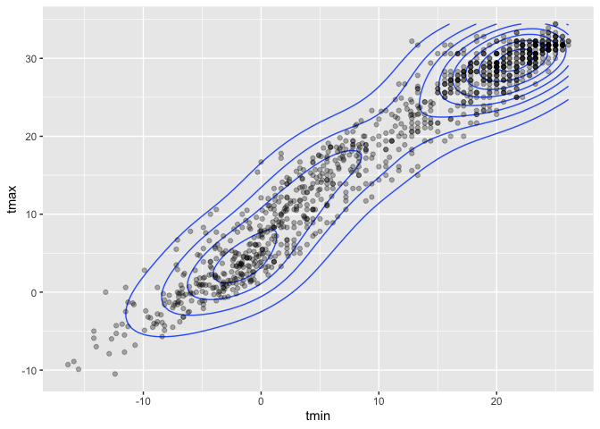
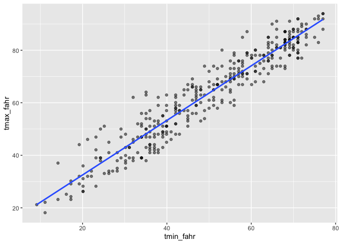
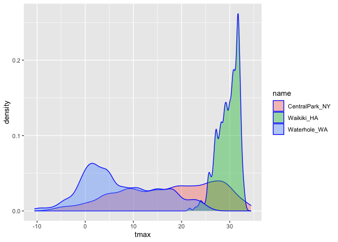

Visualization Part1
================

``` r
library(tidyverse) ##use ggplot 2
```

    ## ── Attaching packages ─────────────────────────────────────── tidyverse 1.3.2 ──
    ## ✔ ggplot2 3.3.6      ✔ purrr   0.3.4 
    ## ✔ tibble  3.1.8      ✔ dplyr   1.0.10
    ## ✔ tidyr   1.2.0      ✔ stringr 1.4.1 
    ## ✔ readr   2.1.2      ✔ forcats 0.5.2 
    ## ── Conflicts ────────────────────────────────────────── tidyverse_conflicts() ──
    ## ✖ dplyr::filter() masks stats::filter()
    ## ✖ dplyr::lag()    masks stats::lag()

``` r
library(ggridges)
```

## Load the dataset

NOAA weather data: use rnoaa::meteo_pull_monitors to download the
dataset

``` r
weather_df = 
  rnoaa::meteo_pull_monitors(
    c("USW00094728", "USC00519397", "USS0023B17S"), #specify the three weathersites
    var = c("PRCP", "TMIN", "TMAX"), 
    date_min = "2017-01-01",
    date_max = "2017-12-31") %>%
  mutate(
    name = recode(
      id, 
      USW00094728 = "CentralPark_NY", 
      USC00519397 = "Waikiki_HA",
      USS0023B17S = "Waterhole_WA"), 
    tmin = tmin / 10,
    tmax = tmax / 10) %>%
  select(name, id, everything())
```

    ## Registered S3 method overwritten by 'hoardr':
    ##   method           from
    ##   print.cache_info httr

    ## using cached file: ~/Library/Caches/R/noaa_ghcnd/USW00094728.dly

    ## date created (size, mb): 2022-10-04 23:26:41 (8.408)

    ## file min/max dates: 1869-01-01 / 2022-10-31

    ## using cached file: ~/Library/Caches/R/noaa_ghcnd/USC00519397.dly

    ## date created (size, mb): 2022-10-04 23:26:46 (1.699)

    ## file min/max dates: 1965-01-01 / 2020-03-31

    ## using cached file: ~/Library/Caches/R/noaa_ghcnd/USS0023B17S.dly

    ## date created (size, mb): 2022-10-04 23:26:49 (0.951)

    ## file min/max dates: 1999-09-01 / 2022-10-31

``` r
weather_df
```

    ## # A tibble: 1,095 × 6
    ##    name           id          date        prcp  tmax  tmin
    ##    <chr>          <chr>       <date>     <dbl> <dbl> <dbl>
    ##  1 CentralPark_NY USW00094728 2017-01-01     0   8.9   4.4
    ##  2 CentralPark_NY USW00094728 2017-01-02    53   5     2.8
    ##  3 CentralPark_NY USW00094728 2017-01-03   147   6.1   3.9
    ##  4 CentralPark_NY USW00094728 2017-01-04     0  11.1   1.1
    ##  5 CentralPark_NY USW00094728 2017-01-05     0   1.1  -2.7
    ##  6 CentralPark_NY USW00094728 2017-01-06    13   0.6  -3.8
    ##  7 CentralPark_NY USW00094728 2017-01-07    81  -3.2  -6.6
    ##  8 CentralPark_NY USW00094728 2017-01-08     0  -3.8  -8.8
    ##  9 CentralPark_NY USW00094728 2017-01-09     0  -4.9  -9.9
    ## 10 CentralPark_NY USW00094728 2017-01-10     0   7.8  -6  
    ## # … with 1,085 more rows

## Scatterplots

Creat first scatterplot

``` r
ggplot(weather_df, aes(x = tmin, y = tmax)) + 
  geom_point()
```

    ## Warning: Removed 15 rows containing missing values (geom_point).

<!-- -->

``` r
#OR 
weather_df %>%
  ggplot(aes(x = tmin, y = tmax)) + 
  geom_point()
```

    ## Warning: Removed 15 rows containing missing values (geom_point).

<!-- -->

### Save and edit a plot object

``` r
plot_weather = 
  weather_df %>%
  ggplot(aes(x = tmin, y = tmax)) 

plot_weather + geom_point()
```

    ## Warning: Removed 15 rows containing missing values (geom_point).

<!-- -->
\### color scatterplot

``` r
ggplot(weather_df, aes(x = tmin, y = tmax)) + 
  geom_point(aes(color = name)) +
  geom_smooth(se = FALSE)
```

    ## `geom_smooth()` using method = 'gam' and formula 'y ~ s(x, bs = "cs")'

    ## Warning: Removed 15 rows containing non-finite values (stat_smooth).

    ## Warning: Removed 15 rows containing missing values (geom_point).

<!-- -->

``` r
# OR
weather_df %>% 
  ggplot(aes(x = tmin, y = tmax, color = name)) + 
  geom_point() +
  geom_smooth(se = FALSE)
```

    ## `geom_smooth()` using method = 'loess' and formula 'y ~ x'

    ## Warning: Removed 15 rows containing non-finite values (stat_smooth).
    ## Removed 15 rows containing missing values (geom_point).

<!-- -->

### add curve

``` r
ggplot(weather_df, aes(x = tmin, y = tmax)) + 
  geom_point(aes(color = name), alpha = .5) +
  geom_smooth(se = FALSE)
```

    ## `geom_smooth()` using method = 'gam' and formula 'y ~ s(x, bs = "cs")'

    ## Warning: Removed 15 rows containing non-finite values (stat_smooth).

    ## Warning: Removed 15 rows containing missing values (geom_point).

<!-- -->

### seperate the scatterplot

``` r
ggplot(weather_df, aes(x = tmin, y = tmax, color = name)) + 
  geom_point(alpha = .5) +
  geom_smooth(se = FALSE) + 
  facet_grid(. ~ name)
```

    ## `geom_smooth()` using method = 'loess' and formula 'y ~ x'

    ## Warning: Removed 15 rows containing non-finite values (stat_smooth).

    ## Warning: Removed 15 rows containing missing values (geom_point).

<!-- -->

``` r
# OR
weather_df %>% 
  ggplot(aes(x = tmin, y = tmax, color = name)) + 
  geom_point(alpha = .2) +
  geom_smooth(se = FALSE) + 
    facet_grid(. ~ name)
```

    ## `geom_smooth()` using method = 'loess' and formula 'y ~ x'

    ## Warning: Removed 15 rows containing non-finite values (stat_smooth).
    ## Removed 15 rows containing missing values (geom_point).

<!-- -->
add curve

``` r
ggplot(weather_df, aes(x = date, y = tmax, color = name)) + 
  geom_point(aes(size = prcp), alpha = .5) +
  geom_smooth(se = FALSE) + 
  facet_grid(. ~ name)
```

    ## `geom_smooth()` using method = 'loess' and formula 'y ~ x'

    ## Warning: Removed 3 rows containing non-finite values (stat_smooth).

    ## Warning: Removed 3 rows containing missing values (geom_point).

<!-- -->

### density curve

``` r
weather_df %>% 
  ggplot(aes(x = tmin, y = tmax)) + 
  geom_density2d() +
  geom_point(alpha = .3) 
```

    ## Warning: Removed 15 rows containing non-finite values (stat_density2d).

    ## Warning: Removed 15 rows containing missing values (geom_point).

<!-- -->

### some small notes

How many geoms have to exist? You can have whatever geoms you want.

``` r
weather_df %>% 
  ggplot(aes(x = tmin, y = tmax, color = name)) + 
  geom_point(alpha = .2) +
  geom_smooth(se = FALSE) 
```

    ## `geom_smooth()` using method = 'loess' and formula 'y ~ x'

    ## Warning: Removed 15 rows containing non-finite values (stat_smooth).

    ## Warning: Removed 15 rows containing missing values (geom_point).

<!-- -->

``` r
weather_df %>% 
  filter(name == "CentralPark_NY") %>% 
  mutate(
    tmax_fahr = tmax * (9 / 5) + 32,
    tmin_fahr = tmin * (9 / 5) + 32) %>% 
  ggplot(aes(x = tmin_fahr, y = tmax_fahr)) +
  geom_point(alpha = .5) + 
  geom_smooth(method = "lm", se = FALSE)
```

    ## `geom_smooth()` using formula 'y ~ x'

<!-- -->

## Other plots

### Odds and ends

``` r
ggplot(weather_df, aes(x = date, y = tmax, color = name)) + 
  geom_smooth(se = FALSE)
```

    ## `geom_smooth()` using method = 'loess' and formula 'y ~ x'

    ## Warning: Removed 3 rows containing non-finite values (stat_smooth).

<!-- -->
There are lots of aesthetics, and these depend to some extent on the
geom – color worked for both geom_point() and geom_smooth(), but shape
only applies to points. The help page for each geom includes a list of
understood aesthetics.

``` r
ggplot(weather_df, aes(x = tmax, y = tmin)) + 
geom_bin2d()
```

    ## Warning: Removed 15 rows containing non-finite values (stat_bin2d).

<!-- -->

``` r
ggplot(weather_df, aes(x = tmax, y = tmin)) +  
geom_density2d()
```

    ## Warning: Removed 15 rows containing non-finite values (stat_density2d).

<!-- -->

``` r
ggplot(weather_df) + geom_point(aes(x = tmax, y = tmin), color = "blue")
```

    ## Warning: Removed 15 rows containing missing values (geom_point).

<!-- -->

``` r
ggplot(weather_df) + geom_point(aes(x = tmax, y = tmin, color = "blue"))
```

    ## Warning: Removed 15 rows containing missing values (geom_point).

<!-- -->
In the first attempt, we’re defining the color of the points by hand; in
the second attempt, we’re implicitly creating a color variable that has
the value blue everywhere; ggplot is then assigning colors according to
this variable using the default color scheme.

## Histogram

``` r
weather_df %>% 
  ggplot(aes(x = tmax)) + 
  geom_histogram()
```

    ## `stat_bin()` using `bins = 30`. Pick better value with `binwidth`.

    ## Warning: Removed 3 rows containing non-finite values (stat_bin).

<!-- -->

``` r
weather_df %>% 
  ggplot(aes(x = tmax, fill = name)) + 
  geom_histogram() +
  facet_grid(.~ name)
```

    ## `stat_bin()` using `bins = 30`. Pick better value with `binwidth`.

    ## Warning: Removed 3 rows containing non-finite values (stat_bin).

<!-- -->

``` r
weather_df %>% 
ggplot(aes(x = tmax, fill = name)) + 
  geom_histogram(position = "dodge", binwidth = 2)
```

    ## Warning: Removed 3 rows containing non-finite values (stat_bin).

<!-- -->

## Density Plot

The adjust parameter in density plots is similar to the binwidth
parameter in histograms, and it helps to try a few values. I set the
transparency level to .4 to make sure all densities appear. You should
also note the distinction between fill and color aesthetics here. You
could facet by name as above but would have to ask if that makes
comparisons easier or harder. Lastly, adding geom_rug() to a density
plot can be a helpful way to show the raw data in addition to the
density.

``` r
weather_df %>% 
ggplot(aes(x = tmax, fill = name)) + 
  geom_density(alpha = .4, adjust = .5, color = "blue")
```

    ## Warning: Removed 3 rows containing non-finite values (stat_density).

<!-- -->
