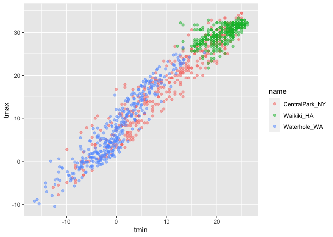

Visualization Part2
================

``` r
library(tidyverse) ##use ggplot 2
```

    ## ── Attaching packages ─────────────────────────────────────── tidyverse 1.3.2 ──
    ## ✔ ggplot2 3.3.6      ✔ purrr   0.3.4 
    ## ✔ tibble  3.1.8      ✔ dplyr   1.0.10
    ## ✔ tidyr   1.2.0      ✔ stringr 1.4.1 
    ## ✔ readr   2.1.2      ✔ forcats 0.5.2 
    ## ── Conflicts ────────────────────────────────────────── tidyverse_conflicts() ──
    ## ✖ dplyr::filter() masks stats::filter()
    ## ✖ dplyr::lag()    masks stats::lag()

``` r
library(patchwork)
```

## Load NOAA weather dataset

NOAA weather data: use rnoaa::meteo_pull_monitors to download the
dataset

``` r
weather_df = 
  rnoaa::meteo_pull_monitors(
    c("USW00094728", "USC00519397", "USS0023B17S"),
    var = c("PRCP", "TMIN", "TMAX"), 
    date_min = "2017-01-01",
    date_max = "2017-12-31") %>%
  mutate(
    name = recode(
      id, 
      USW00094728 = "CentralPark_NY", 
      USC00519397 = "Waikiki_HA",
      USS0023B17S = "Waterhole_WA"),
    tmin = tmin / 10,
    tmax = tmax / 10) %>%
  select(name, id, everything())
```

    ## Registered S3 method overwritten by 'hoardr':
    ##   method           from
    ##   print.cache_info httr

    ## using cached file: ~/Library/Caches/R/noaa_ghcnd/USW00094728.dly

    ## date created (size, mb): 2022-10-04 23:26:41 (8.408)

    ## file min/max dates: 1869-01-01 / 2022-10-31

    ## using cached file: ~/Library/Caches/R/noaa_ghcnd/USC00519397.dly

    ## date created (size, mb): 2022-10-04 23:26:46 (1.699)

    ## file min/max dates: 1965-01-01 / 2020-03-31

    ## using cached file: ~/Library/Caches/R/noaa_ghcnd/USS0023B17S.dly

    ## date created (size, mb): 2022-10-04 23:26:49 (0.951)

    ## file min/max dates: 1999-09-01 / 2022-10-31

``` r
weather_df
```

    ## # A tibble: 1,095 × 6
    ##    name           id          date        prcp  tmax  tmin
    ##    <chr>          <chr>       <date>     <dbl> <dbl> <dbl>
    ##  1 CentralPark_NY USW00094728 2017-01-01     0   8.9   4.4
    ##  2 CentralPark_NY USW00094728 2017-01-02    53   5     2.8
    ##  3 CentralPark_NY USW00094728 2017-01-03   147   6.1   3.9
    ##  4 CentralPark_NY USW00094728 2017-01-04     0  11.1   1.1
    ##  5 CentralPark_NY USW00094728 2017-01-05     0   1.1  -2.7
    ##  6 CentralPark_NY USW00094728 2017-01-06    13   0.6  -3.8
    ##  7 CentralPark_NY USW00094728 2017-01-07    81  -3.2  -6.6
    ##  8 CentralPark_NY USW00094728 2017-01-08     0  -3.8  -8.8
    ##  9 CentralPark_NY USW00094728 2017-01-09     0  -4.9  -9.9
    ## 10 CentralPark_NY USW00094728 2017-01-10     0   7.8  -6  
    ## # … with 1,085 more rows

## Review Scatterplots

scatterplot of tmax against tmin

``` r
weather_df %>% 
  ggplot(aes(x = tmin, y = tmax)) + 
  geom_point(aes(color = name), alpha = .5)
```

    ## Warning: Removed 15 rows containing missing values (geom_point).

<!-- -->
