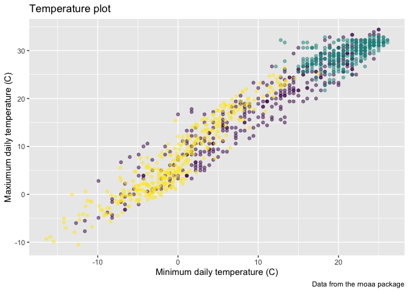

Visualization Part2
================

``` r
library(tidyverse) ##use ggplot 2
```

    ## ── Attaching packages ─────────────────────────────────────── tidyverse 1.3.2 ──
    ## ✔ ggplot2 3.3.6      ✔ purrr   0.3.4 
    ## ✔ tibble  3.1.8      ✔ dplyr   1.0.10
    ## ✔ tidyr   1.2.0      ✔ stringr 1.4.1 
    ## ✔ readr   2.1.2      ✔ forcats 0.5.2 
    ## ── Conflicts ────────────────────────────────────────── tidyverse_conflicts() ──
    ## ✖ dplyr::filter() masks stats::filter()
    ## ✖ dplyr::lag()    masks stats::lag()

``` r
library(patchwork)
```

## Load NOAA weather dataset

NOAA weather data: use rnoaa::meteo_pull_monitors to download the
dataset

``` r
weather_df = 
  rnoaa::meteo_pull_monitors(
    c("USW00094728", "USC00519397", "USS0023B17S"),
    var = c("PRCP", "TMIN", "TMAX"), 
    date_min = "2017-01-01",
    date_max = "2017-12-31") %>%
  mutate(
    name = recode(
      id, 
      USW00094728 = "CentralPark_NY", 
      USC00519397 = "Waikiki_HA",
      USS0023B17S = "Waterhole_WA"),
    tmin = tmin / 10,
    tmax = tmax / 10) %>%
  select(name, id, everything())
```

    ## Registered S3 method overwritten by 'hoardr':
    ##   method           from
    ##   print.cache_info httr

    ## using cached file: ~/Library/Caches/R/noaa_ghcnd/USW00094728.dly

    ## date created (size, mb): 2022-10-04 23:26:41 (8.408)

    ## file min/max dates: 1869-01-01 / 2022-10-31

    ## using cached file: ~/Library/Caches/R/noaa_ghcnd/USC00519397.dly

    ## date created (size, mb): 2022-10-04 23:26:46 (1.699)

    ## file min/max dates: 1965-01-01 / 2020-03-31

    ## using cached file: ~/Library/Caches/R/noaa_ghcnd/USS0023B17S.dly

    ## date created (size, mb): 2022-10-04 23:26:49 (0.951)

    ## file min/max dates: 1999-09-01 / 2022-10-31

``` r
weather_df
```

    ## # A tibble: 1,095 × 6
    ##    name           id          date        prcp  tmax  tmin
    ##    <chr>          <chr>       <date>     <dbl> <dbl> <dbl>
    ##  1 CentralPark_NY USW00094728 2017-01-01     0   8.9   4.4
    ##  2 CentralPark_NY USW00094728 2017-01-02    53   5     2.8
    ##  3 CentralPark_NY USW00094728 2017-01-03   147   6.1   3.9
    ##  4 CentralPark_NY USW00094728 2017-01-04     0  11.1   1.1
    ##  5 CentralPark_NY USW00094728 2017-01-05     0   1.1  -2.7
    ##  6 CentralPark_NY USW00094728 2017-01-06    13   0.6  -3.8
    ##  7 CentralPark_NY USW00094728 2017-01-07    81  -3.2  -6.6
    ##  8 CentralPark_NY USW00094728 2017-01-08     0  -3.8  -8.8
    ##  9 CentralPark_NY USW00094728 2017-01-09     0  -4.9  -9.9
    ## 10 CentralPark_NY USW00094728 2017-01-10     0   7.8  -6  
    ## # … with 1,085 more rows

## Review Scatterplots

Scatterplot of tmax against tmin

``` r
weather_df %>% 
  ggplot(aes(x = tmin, y = tmax)) + 
  geom_point(aes(color = name), alpha = .5)
```

    ## Warning: Removed 15 rows containing missing values (geom_point).

<!-- -->

## Labels

Provide informative axis labels, plot titles, and captions, all of which
can be controlled using labs().

``` r
weather_df %>% 
  ggplot(aes(x = tmin, y = tmax)) + 
  geom_point(aes(color = name), alpha = .5) + 
  labs(
    title = "Temperature plot",
    x = "Minimum daily temperature (C)",
    y = "Maxiumum daily temperature (C)",
    caption = "Data from the rnoaa package"
  )
```

    ## Warning: Removed 15 rows containing missing values (geom_point).

<!-- -->

## Scale

坐标轴刻度线x轴y轴：scale_x\_\* and scale_y\_\* where \* depends on the
type of variable mapped to the x and y aesthetics (i.e. continuous vs
discrete).

``` r
weather_df %>% 
  ggplot(aes(x = tmin, y = tmax)) + 
  geom_point(aes(color = name), alpha = .5) + 
  labs(
    title = "Temperature plot",
    x = "Minimum daily temperature (C)",
    y = "Maxiumum daily temperature (C)",
    caption = "Data from the rnoaa package") + 
  scale_x_continuous(
    breaks = c(-15, 0, 15), 
    labels = c("-15º C", "0", "15"))
```

    ## Warning: Removed 15 rows containing missing values (geom_point).

<!-- -->

### Complex Scales

scale_y\_sqrt() can be added to a ggplot object to transform the Y scale
xlim() can be used to control the plot limits in the X axis.

``` r
weather_df %>% 
  ggplot(aes(x = tmin, y = tmax)) + 
  geom_point(aes(color = name), alpha = .5) + 
  labs(
    title = "Temperature plot",
    x = "Minimum daily temperature (C)",
    y = "Maxiumum daily temperature (C)",
    caption = "Data from the rnoaa package") + 
  scale_x_continuous(
    breaks = c(-15, 0, 15), 
    labels = c("-15ºC", "0", "15"),
    limits = c(-20, 30)) + 
  scale_y_continuous(
    trans = "sqrt", 
    position = "right")
```

    ## Warning in self$trans$transform(x): NaNs produced

    ## Warning: Transformation introduced infinite values in continuous y-axis

    ## Warning: Removed 90 rows containing missing values (geom_point).

<!-- -->

arguments to scale_color_hue() control the color scale and the name in
the plot legend.

``` r
weather_df %>% 
  ggplot(aes(x = tmin, y = tmax)) + 
  geom_point(aes(color = name), alpha = .5) + 
  labs(
    title = "Temperature plot",
    x = "Minimum daily temperature (C)",
    y = "Maxiumum daily temperature (C)",
    caption = "Data from the rnoaa package") + 
    scale_color_hue(name = "Location", h = c(100, 300))
```

    ## Warning: Removed 15 rows containing missing values (geom_point).

<!-- -->

use the viridis package to create your own color scheme The
viridis::scale_fill_viridis() function is appropriate for the fill
aesthetic used in histograms, density plots, and elsewhere

``` r
ggp_temp_plot = 
  weather_df %>% 
  ggplot(aes(x = tmin, y = tmax)) + 
  geom_point(aes(color = name), alpha = .5) + 
  labs(
    title = "Temperature plot",
    x = "Minimum daily temperature (C)",
    y = "Maxiumum daily temperature (C)",
    caption = "Data from the rnoaa package"
  ) + 
  viridis::scale_color_viridis(
    name = "Location", 
    discrete = TRUE  #discrete = TRUE because the color aesthetic is mapped to a discrete variable.if it is a continuous color gradient, omit this code;
  )

ggp_temp_plot
```

    ## Warning: Removed 15 rows containing missing values (geom_point).

<!-- -->

## Themes

Themes are used to modify non-data elements of a plot – they don’t
change mappings or how data are render, but control things like
background color and location of the the legend. Using themes can help
with general plot appearance.

### legend position

``` r
ggp_temp_plot + 
  theme(legend.position = "bottom")
```

    ## Warning: Removed 15 rows containing missing values (geom_point).

<!-- -->

remove ledend

``` r
ggp_temp_plot + 
  theme(legend.position = "none")
```

    ## Warning: Removed 15 rows containing missing values (geom_point).

<!-- -->

### Different themes

While you can manage specific theme elements individually, I recommend
using a built-in theme. By default this is theme_gray;

here’s theme_bw(): Notes: The ordering of theme_bw() and theme() matters
– theme() changes a particular element of the plot’s current “theme”. If
you call theme to change the some element and then theme_bw(), the
changes introduced by theme() are overwritten by theme_bw()

``` r
ggp_temp_plot + 
  theme_bw() + 
  theme(legend.position = "bottom")
```

    ## Warning: Removed 15 rows containing missing values (geom_point).

<!-- -->

theme_classic():

``` r
ggp_temp_plot + 
  theme_classic() + 
  theme(legend.position = "bottom")
```

    ## Warning: Removed 15 rows containing missing values (geom_point).

<!-- -->

## Setting options

In addition to figure sizing, I include a few other figure preferences
in global options declared at the outset of each .Rmd file this code
chunk just gets copy-and-pasted to the beginning of every new file.
There are ways to set color preferences globally as well (for example,
to use viridis color palettes.

``` r
library(tidyverse)

knitr::opts_chunk$set(
  fig.width = 6,
  fig.asp = .6,
  out.width = "90%"
)

theme_set(theme_minimal() + theme(legend.position = "bottom"))

options(
  ggplot2.continuous.colour = "viridis",
  ggplot2.continuous.fill = "viridis"
)

scale_colour_discrete = scale_colour_viridis_d
scale_fill_discrete = scale_fill_viridis_d
```

## Data argument in geom\_\*

Depending on the setting, one way to do this is to create a “summary”
dataframe and use that when adding a new geom to a ggplot based on the
full data.

``` r
central_park = 
  weather_df %>% 
  filter(name == "CentralPark_NY")

waikiki = 
  weather_df %>% 
  filter(name == "Waikiki_HA")

ggplot(data = waikiki, aes(x = date, y = tmax, color = name)) + 
  geom_point() + 
  geom_line(data = central_park)
```

    ## Warning: Removed 3 rows containing missing values (geom_point).


## patchwork

if I want to show two or three fundamentally different plots in the same
graphic The solution is to create each of the panels you want separately
and combine panels using tools in the patchwork package

``` r
tmax_tmin_p = 
  weather_df %>% 
  ggplot(aes(x = tmax, y = tmin, color = name)) + 
  geom_point(alpha = .5) +
  theme(legend.position = "none")

prcp_dens_p = 
  weather_df %>% 
  filter(prcp > 0) %>% 
  ggplot(aes(x = prcp, fill = name)) + 
  geom_density(alpha = .5) + 
  theme(legend.position = "none")

tmax_date_p = 
  weather_df %>% 
  ggplot(aes(x = date, y = tmax, color = name)) + 
  geom_point(alpha = .5) +
  geom_smooth(se = FALSE) + 
  theme(legend.position = "bottom")

(tmax_tmin_p + prcp_dens_p) / tmax_date_p
```

    ## Warning: Removed 15 rows containing missing values (geom_point).

    ## `geom_smooth()` using method = 'loess' and formula 'y ~ x'

    ## Warning: Removed 3 rows containing non-finite values (stat_smooth).

    ## Warning: Removed 3 rows containing missing values (geom_point).


## Data Manipulation

Data manipulation is important for the order of categorical or factor
variables in plots. \* Categorical variables will be ordered
alphabetically; \* Factors will follow the specified order level that
underlies the variable labels.

You can change the order level of a factor variable to your specified
preference using forcats::fct_relevel or according to the value of
another variable using forcats::fct_reorder.

### reorder

reorders name “by hand”:

``` r
weather_df %>%
  mutate(name = forcats::fct_relevel(name, c("Waikiki_HA", "CentralPark_NY", "Waterhole_WA"))) %>% 
  ggplot(aes(x = name, y = tmax)) + 
  geom_violin(aes(fill = name), color = "blue", alpha = .5) + 
  theme(legend.position = "bottom")
```

    ## Warning: Removed 3 rows containing non-finite values (stat_ydensity).


reorders name according to tmax values in each name:

``` r
weather_df %>%
  mutate(name = forcats::fct_reorder(name, tmax)) %>% 
  ggplot(aes(x = name, y = tmax)) + 
  geom_violin(aes(fill = name), color = "blue", alpha = .5) + 
  theme(legend.position = "bottom")
```

    ## Warning: Removed 3 rows containing non-finite values (stat_ydensity).


### panel plot

``` r
weather_df %>%
  select(name, tmax, tmin) %>% 
  pivot_longer(
    tmax:tmin,
    names_to = "observation", 
    values_to = "temp") %>% 
  ggplot(aes(x = temp, fill = observation)) +
  geom_density(alpha = .5) + 
  facet_grid(~name) + 
  viridis::scale_fill_viridis(discrete = TRUE)
```

    ## Warning: Removed 18 rows containing non-finite values (stat_density).


### Other examples

Some steps that are helpful in retrospect are using pivot_longer to
organize the BDI score and visit time variables, and organizing the
visit time variable into a factor with an informative ordering.

``` r
pulse_data = 
  haven::read_sas("./public_pulse_data.sas7bdat") %>%
  janitor::clean_names() %>%
  pivot_longer(
    bdi_score_bl:bdi_score_12m,
    names_to = "visit", 
    names_prefix = "bdi_score_",
    values_to = "bdi") %>%
  select(id, visit, everything()) %>%
  mutate(
    visit = recode(visit, "bl" = "00m"),
    visit = factor(visit, levels = str_c(c("00", "01", "06", "12"), "m"))) %>%
  arrange(id, visit)

ggplot(pulse_data, aes(x = visit, y = bdi)) + 
  geom_boxplot()
```

    ## Warning: Removed 879 rows containing non-finite values (stat_boxplot).


``` r
#Some steps that are helpful in retrospect are using pivot_longer to organize the BDI score and visit time variables, and organizing the visit time variable into a factor with an informative ordering;
```

Here we add some data tidying steps to view pup-level outcomes
(post-natal day on which ears “work”, on which the pup can walk, etc)
across values of dose category and treatment day.

``` r
pup_data = 
  read_csv("./FAS_pups.csv", col_types = "ciiiii") %>%
  janitor::clean_names() %>%
  mutate(sex = recode(sex, `1` = "male", `2` = "female")) 

litter_data = 
  read_csv("./FAS_litters.csv", col_types = "ccddiiii") %>%
  janitor::clean_names() %>%
  separate(group, into = c("dose", "day_of_tx"), sep = 3)

fas_data = left_join(pup_data, litter_data, by = "litter_number") 

fas_data %>% 
  select(sex, dose, day_of_tx, pd_ears:pd_walk) %>% 
  pivot_longer(
    pd_ears:pd_walk,
    names_to = "outcome", 
    values_to = "pn_day") %>% 
  drop_na() %>% 
  mutate(outcome = forcats::fct_reorder(outcome, pn_day, median)) %>% 
  ggplot(aes(x = dose, y = pn_day)) + 
  geom_violin() + 
  facet_grid(day_of_tx ~ outcome)
```


